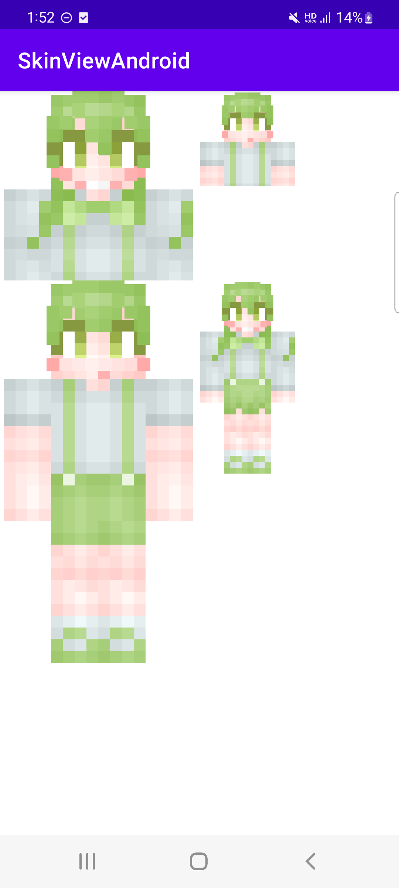

# SkinViewAndroid

SkinViewAndroid shows your Minecraft game's human model (called "skin") in 2D or 3D in your Android application. This code perfectly implements the functionality we expected. However, as a library that is close to beta, it may not be able to fully respond to all situations.

Actually, that library is used to render skins in our service "Store for Minecraft".

**It support**

- 64 x 32, 64 x 64, any 1:1 ratio skin image
- slim type skin image

## Importing Library

**Step 1.** Add the JitPack repository to your build file

Add it in your root build.gradle at the end of repositories:

```groovy
allprojects {
	repositories {
		...
		maven { url 'https://jitpack.io' }
	}
}
```

**Step 2.** Add the dependency

```groovy
dependencies {
	implementation 'com.github.storeforminecraft:SkinViewAndroid:{version}'
}
```

[](https://jitpack.io/#storeforminecraft/SkinViewAndroid)

## 3D SkinView


3D SkinView is implemented using Open GL. You can use "SkinView3DSurfaceView" by adding it to an existing layout or setting it as the Activity's ContentView.

```kotlin
class MainActivity : AppCompatActivity() {

    private lateinit var gLView: SkinView3DSurfaceView

    override fun onCreate(savedInstanceState: Bundle?) {
        super.onCreate(savedInstanceState)
        gLView = SkinView3DSurfaceView(this)
        gLView.render(bitmap) // set bitmap of skin image
        setContentView(gLView)
    }
}
```

## 2D SkinView



2DSkinView renders the front part of the skin. 

2DSkinView has a halfView option that only shows the upper body of the skin. 

"scale" specifies how many times the original image of the skin will be enlarged to render. In most cases, use "16", "32".

```xml
<?xml version="1.0" encoding="utf-8"?>
<LinearLayout xmlns:android="http://schemas.android.com/apk/res/android"
    xmlns:app="http://schemas.android.com/apk/res-auto"
    xmlns:tools="http://schemas.android.com/tools"
    android:layout_width="match_parent"
    android:layout_height="match_parent">
  	...
    <dev.storeforminecraft.skinviewandroid.library.twodimension.ui.FlatSkinView
        android:layout_width="wrap_content"
        android:layout_height="wrap_content"
        app:scale="32"
        app:halfview="false"
        app:skin="@raw/skin" />
  	...
</LinearLayout>
```

## We: Store for Minecraft

CONTACT : manager@storeforminecraft.com

[LICENSE](LICENSE)
